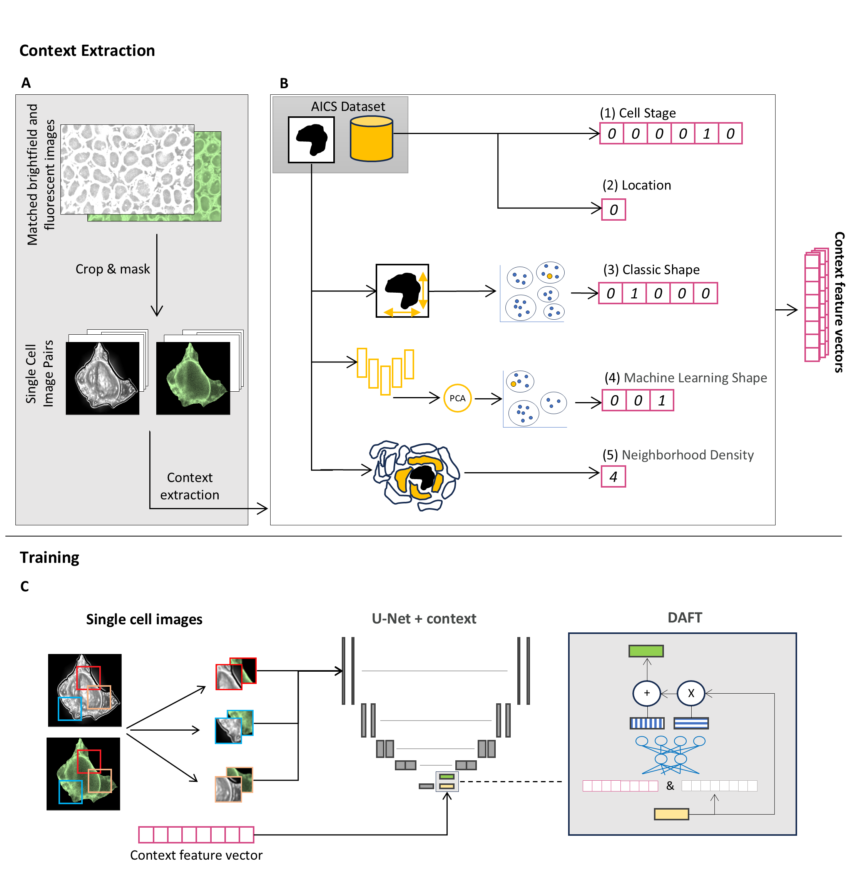

# CELTIC
**CE**ll in silico **L**abeling using **T**abular **I**nput **C**ontext

## Paper Abstract

In silico labeling prediction of organelle fluorescence from label-free microscopy images has the potential to revolutionize our understanding of cells as integrated complex systems. However, out-of-distribution data caused by changes in the intracellular organization across cell types, cellular processes or perturbations, can lead to altered label-free images and impaired in silico labeling. We demonstrated that incorporating biological meaningful cell contexts, via a context-dependent model that we call CELTIC, enhanced in silico labeling prediction and enabled downstream analysis of out-of-distribution data such as cells undergoing mitosis, and cells located at the edge of the colony. These results suggest a link between cell context and intracellular organization. Using CELTIC for generative traversal along single cells undergoing context transition enabled integrated characterization of the gradual alterations in cellular organization across multiple organelles, overcoming inter-cell variability. The explicit inclusion of context has the potential to harmonize multiple datasets, paving the way for generalized in silico labeling foundation models.




## Documentation

### Overview
CELTIC (Cell in silico Labeling using Tabular Input Context) is a framework designed to predict organelle fluorescence in label-free microscopy images by incorporating biologically meaningful cell contexts. This repository includes the source code for training, predicting, and creating the context vectors used in the CELTIC model.

The repository is structured to allow users to easily replicate the workflow for training and predicting with CELTIC, as well as to understand the context creation process. Below, you will find the necessary steps for running each part of the pipeline, as well as links to the corresponding Colab notebooks.

### Colab Notebooks
- **Training the CELTIC Model**: 

    This notebook demonstrates how to train the CELTIC model using single cell images and context data. 
    
    [](https://colab.research.google.com/github/nts-e/CELTIC/blob/main/examples/train.ipynb)
    [](https://github.com/nts-e/CELTIC/blob/main/examples/train.ipynb)

    

- **Prediction with the CELTIC Model**:

    This notebook shows how to run predictions using the trained single cell model, both with and without context. It allows for the comparison of results and demonstrates how context improves the prediction accuracy.
    
    [](https://colab.research.google.com/github/nts-e/CELTIC/blob/main/examples/predict.ipynb)
    [](https://github.com/nts-e/CELTIC/blob/main/examples/predict.ipynb)
    
    

- **Context Creation**:

    This notebook provides a detailed walkthrough of how to create the cell context features used in the CELTIC model.
    
    [](https://colab.research.google.com/github/nts-e/CELTIC/blob/main/examples/context_creation.ipynb)
    [](https://github.com/nts-e/CELTIC/blob/main/examples/context_creation.ipynb)  
    
    

## Installation and Setup

1. Clone the repository:
   ```bash
   git clone https://github.com/zaritskylab/CELTIC

2. Install the required dependencies:
    ```bash
    %cd CELTIC
    !pip install .
